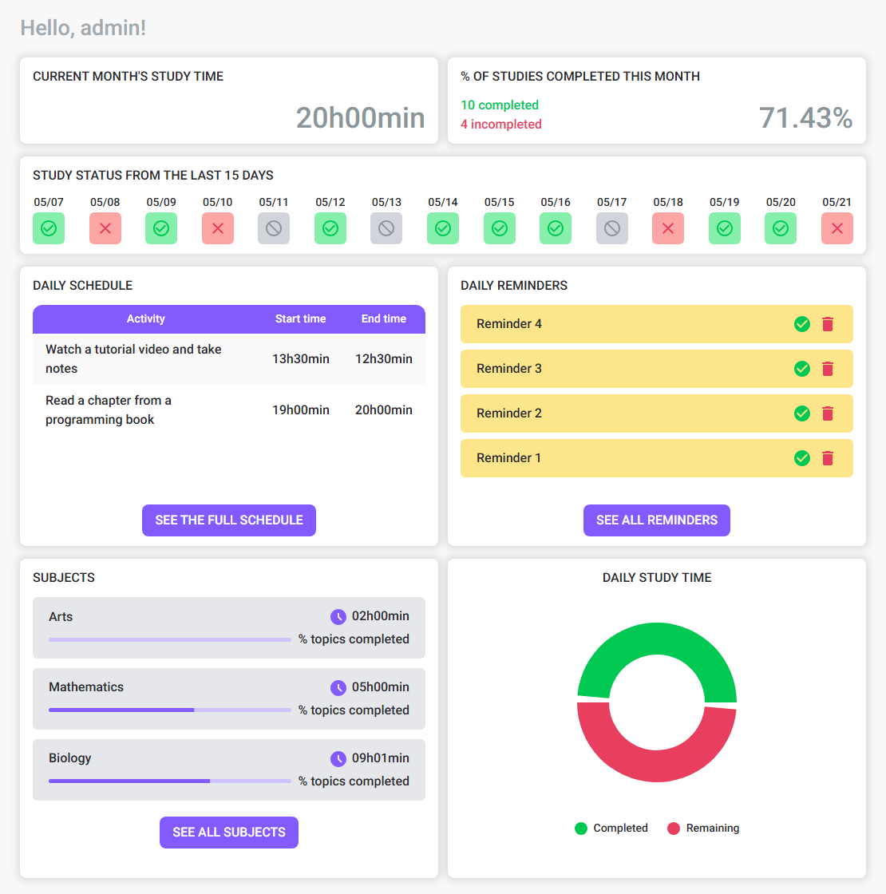

<p align="center">
  
  
 <a href="/README.md">
  
</a>

</p>

<p align="center">
  
  
  
  
  
  
  
  
  
  
</p>

</br>

# O que é o iStudy?
O iStudy é uma plataforma web projetada para ajudar estudantes a organizar, gerenciar e acompanhar seus hábitos de estudo de forma eficiente. Entre seus diversos recursos estão:

- Cadastro e login de usuários;
- Gerenciamento de disciplinas e seus tópicos;
- Acompanhamento dos estudos, com base nas disciplinas e tópicos cadastrados;
- Jogos de estudo, como flashcards e quizzes para reforçar o aprendizado;
- Ferramentas de gerenciamento de tempo (cronômetro e timer Pomodoro);
- Gerenciamento de cronograma e lembretes;
- Gráficos com métricas de horas de estudo por disciplina, tópico e categoria (diárias, semanais e mensais).

</br>

# Estrutura do Projeto
- `istudy-app`: Esta pasta contém o código do front-end da aplicação, desenvolvido com TypeScript, React.js e NextJS.
- `istudy-services`: Esta pasta contém o back-end do sistema (Java/Spring Boot), que segue uma arquitetura de microsserviços utilizando o Spring Cloud API Gateway como interceptador de requisições e Spring Cloud Netflix (Eureka) para registro e descoberta de serviços.

## Arquitetura do Sistema


## Diagrama EER do Banco de Dados


</br>

# Tecnologias Utilizadas
## Back-End
* **Java**: Uma linguagem de programação de alto nível, orientada a objetos, amplamente utilizada para desenvolvimento de aplicações server-side, serviços web e aplicações Android.

* **Spring Boot**: Um framework que simplifica o desenvolvimento de aplicações Java, oferecendo funcionalidades integradas para injeção de dependências, configuração e suporte a microsserviços.

* **Spring Security**: Um framework poderoso e personalizável para autenticação e controle de acesso em aplicações Java.

* **JWT (JSON Web Token)**: Padrão aberto que permite a transmissão segura de informações de autenticação.

* **Spring Cloud API Gateway**: Serve como ponto central de entrada, lidando com roteamento de requisições, autenticação e controle de tráfego entre os microsserviços.

* **Spring Cloud Netflix Eureka**: Permite o registro e descoberta automática dos microsserviços, facilitando o escalonamento dinâmico e a comunicação transparente.

* **RabbitMQ**: Um software de código aberto que atua como intermediário de mensagens entre produtores e consumidores.

* **Jakarta Bean Validation**: Um framework padrão para declarar e validar restrições em objetos Java usando anotações, amplamente utilizado para aplicar regras de negócio e validações de entrada de forma limpa e declarativa.

* **JPA**: A Java Persistence API, uma especificação que fornece mapeamento objeto-relacional (ORM) para gerenciar dados relacionais em aplicações Java.

* **MapStruct**: Um framework de mapeamento em Java que simplifica a conversão de objetos, reduzindo código repetitivo e melhorando a manutenção.

* **Flyway**: Uma ferramenta de migração de banco de dados que garante controle de versão e consistência nas alterações do esquema.

* **Lombok**: Uma biblioteca Java que reduz código repetitivo ao gerar automaticamente métodos comuns como getters, setters, construtores, entre outros, por meio de anotações.

* **Postman**: Ferramenta usada para testes e desenvolvimento de APIs, permitindo o envio de requisições HTTP, análise de respostas e automação de testes.

## Front-End
* **TypeScript**: Um superset do JavaScript que adiciona tipagem estática, tornando o código mais fácil de ler, depurar e manter.

* **React.js**: Uma biblioteca JavaScript para construção de interfaces de usuário, com foco na criação de componentes reutilizáveis e gerenciamento da camada de visualização de aplicações web.

* **NextJS**: Um framework React que oferece funcionalidades adicionais, como renderização no lado do servidor e renderização estática.

* **TailwindCSS**: Um framework CSS utilitário que permite o desenvolvimento rápido de interfaces usando classes pré-definidas.

* **Material UI (MUI)**: Uma vasta biblioteca de componentes de UI que designers e desenvolvedores podem usar para construir aplicações em React.

* **Tanstack/React Query**: Biblioteca de gerenciamento de estado e busca de dados no React, ideal para gerenciar estado do servidor com recursos como cache, atualizações em segundo plano e tentativas automáticas.

* **JWT Decode**: Biblioteca que decodifica tokens JWT sem verificar sua assinatura.

* **Lucide React**: Biblioteca React que fornece acesso ao conjunto consistente e elegante de ícones SVG do Lucide.

* **React Toastify**: Biblioteca React para exibir notificações tipo toast de forma simples e customizável.

* **Formik**: Biblioteca para gerenciamento de formulários no React, que simplifica manipulação, validação e envio de formulários.

* **Yup**: Construtor de esquemas em JavaScript para análise e validação de valores, frequentemente usado com Formik.

* **DayJs**: Biblioteca JavaScript leve para análise, validação, manipulação e formatação de datas.

* **Swiper js**: Biblioteca JavaScript gratuita e poderosa para criação de sliders e carrosséis modernos e responsivos.

* **React card flip**: Componente que permite criar cartões que giram e revelam conteúdo ao interagir.

* **React calendar**: Componente de calendário leve e de fácil configuração.

## Banco de Dados e Outras Tecnologias
* **MySQL**: Sistema de gerenciamento de banco de dados relacional utilizado para armazenamento e gerenciamento confiável de dados.

* **Docker**: Plataforma que permite aos desenvolvedores automatizar a implantação de aplicações em contêineres leves, garantindo consistência entre ambientes e simplificando o processo de configuração.

</br>

# Requisitos
Para executar o projeto em sua máquina, as seguintes ferramentas devem estar instaladas e configuradas previamente:

- Docker
- Git

Opcionais para desenvolvimento ou testes locais:

- Java Development Kit (JDK) 17
- Node.js
- Apache Maven
- MySQL 8.0.34
- MySQL Workbench
- Postman

</br>

# Guia de Instalação
Siga os passos abaixo para baixar, configurar e executar o projeto no seu ambiente:

1. **Clone o repositório**
```bash
git clone https://github.com/ABeatrizSC/istudy.git
```

2. **Navegue até o diretório do projeto**
```bash
cd istudy
```

3. **Construa e inicialize o container docker**
```bash
docker-compose up --build
```

</br>

# iStudy-app - Front-End
## Pré-visualização das Páginas
### Página de Login
 

### Página de Registro
 

### Página Inicial
 

### Página de Matérias

#### Modal de Criar/Atualizar Matéria
 
#### Modal de Deletar Matéria
 

### Página de Gerenciamento de Matérias

#### Modal de Criar/Atualizar Tópico
 
#### Modal de Deletar Tópico
 

### Página de Estudos
 
#### Modal de Criar/Atualizar Estudo
 
#### Modal de Deletar Estudo
 

### Página de Informações Estatísticas dos Estudos
 

### Página de Lembretes
 

### Página de Cronogramas
 
#### Modal de Criar/Atualizar Item do Cronograma
 
#### Modal de Deletar Item do Cronograma
 

### Página de Calendário
 

### Jogos
#### Página de Flashcards
 
#### Modal de Criar/Atualizar Flashcard
 
#### Modal de Deletar Flashcard
 
#### Página do Jogo de Flashcard
 
#### Página de Resultado do Jogo de Flashcard
 
#### Página de Quiz
 
#### Modal de Criar/Atualizar Quiz
 
#### Modal de Deletar Quiz
 
#### Página do Jogo de Quiz
 
#### Página de Resultado do Jogo de Quiz
 

### Monitorador de Tempo
#### Página do Cronômetro
 
#### Página do Pomodoro
 
##### Modal de Configurações do Pomodoro
 

</br>

# iStudy-services - Back-End
## 1. AUTH-MS
- Microsserviço de autenticação e gerenciamento de usuários.

### **POST** `/auth/register`
- Cria um novo usuário.

#### Corpo da requisição

```json
{
    "name": "New user",
    "email": "newuser@email.com",
    "password": "12345678"
}
```

#### Corpo de resposta de sucesso

```json
{
    "message": "User created successfully!"
}
```
---

### **POST** `/auth/login`
- Autentica um usuário, retornando um Bearer token.

#### Corpo da requisição

```json
{
    "email": "newuser@email.com",
    "password": "12345678"
}
```

#### Corpo de resposta de sucesso

```json
{
    "token": "ey..."
}
```

</br>

## 2. DISCIPLINE-MS
- Microsserviço responsável por gerenciar matérias e seus tópicos.

### DISCIPLINE ENDPOINTS

### **POST** `/disciplines`
- Cria uma nova matéria.

#### Corpo da requisição
- `DisciplineRequestDto`:

```json
{
  "name": "Mathematics",
  "category": "EXACT_SCIENCES",
  "isCompleted": false
}
```

#### Corpo de resposta de sucesso
- Status: `201 Created`.
- Retorna um `List<Discipline>`: 

```json
[
    {
        "id": "0ff67f43-11c2-458c-a88c-753f3c939a33",
        "createdBy": "6a93f671-9406-42ea-8b0c-5d7ef65ea9b5",
        "name": "Mathematics",
        "category": "EXACT_SCIENCES",
        "totalTime": "00:00",
        "timeCompleted": "00:00",
        "isCompleted": false,
        "topics": []
    }
]
```
---
### **PUT** `/disciplines/{id}`
- Atualiza a matéria do id passado.

#### Corpo da requisição
- `DisciplineRequestDto`

#### Corpo de resposta de sucesso
- `List<Discipline>` atualizado. 

---
### **DELETE** `/disciplines/{id}`
- Deleta, se existir, a matéria que contém o id passado.

#### Corpo de resposta de sucesso
- `List<Discipline>` atualizado. 

---

### **GET** `/disciplines/{id}`
- Retorna, se encontrado, a matéria que contém o id informado.

#### Corpo de resposta de sucesso
- `Discipline`. 

---

### **GET** `/disciplines?name={name}`
- Retorna todas as matérias de um usuário que contêm em seu nome a sequência de caracteres fornecido no parâmentro.

#### Corpo de resposta de sucesso
- `List<Discipline>` 

---

### **GET** `/disciplines/categories/{category}`
- Retorna todas as matérias do usuário que contêm a categoria informada.

#### Corpo de resposta de sucesso
- `List<Discipline>` 

---

### **GET** `/disciplines/category`
- Retorna uma lista de Strings com todas as categorias de matérias disponíveis na API.

#### Corpo de resposta de sucesso
- `List<String>` 

```json
[
  "EXACT_SCIENCES",
  "HUMAN_SCIENCES",
  "BIOLOGICAL_SCIENCES",
  "SOCIAL_SCIENCES",
  "HEALTH_SCIENCES",
  "ARTS_AND_HUMANITIES"
]
```
---

### **GET** `/disciplines/completed`
- Retorna todas as matérias do usuário que têm o atributo `isCompleted` definido como `true`.

#### Corpo de resposta de sucesso
- `List<Discipline>` 

</br>

### TOPIC ENDPOINTS
### **POST** `/disciplines/topics`
- Cria um novo tópico.

#### Corpo da requisição
- `TopicRequestDto`:

```json
{
  "name": "New topic",
  "time": "03:00",
  "isCompleted": false,
  "disciplineId": "uuid"
}
```

#### Corpo de resposta de sucesso
- `List<TopicResponseDto>` atualizado.

```json
[
  {
    "id": "uuid",
    "name": "Topic 1",
    "time": "01:30",
    "isCompleted": true,
    "disciplineId": "uuid"
  },
  {
    "id": "uuid",
    "name": "New topic",
    "time": "03:00",
    "isCompleted": false,
    "disciplineId": "uuid"
  }
  //...
]
```

---

### **PUT** `/disciplines/topics/{id}`
- Atualiza o tópico do id passado.

### Corpo da requisição
- `TopicUpdateDto`:

```json
{
  "name": "New topic updated",
  "time": "03:00",
  "isCompleted": false,
}
```

#### Corpo de resposta de sucesso
- `List<TopicResponseDto>` atualizado.

---

### **DELETE** `/disciplines/topics/{id}`
- Deleta, se existir, o tópico que contém o id passado.

#### Corpo de resposta de sucesso
- `List<TopicResponseDto>` atualizado.

---

### **GET** `/disciplines/topics/all`
- Retorna todas os tópicos do usuário.

#### Corpo de resposta de sucesso
- `List<TopicResponseDto>`

---

### **GET** `/disciplines/topics/{id}`
- Retorna, se encontrado, o tópico do id informado.

- #### Corpo de resposta de sucesso
- `TopicResponseDto`

</br>

## 3. STUDY-TRACKER-MS
- Microsseviço responsável por gerenciar sessões de estudo. Ele permite ao usuário acessar, criar, atualizar e deletar estudos.
- Além disso, é possível obter informações mais detalhadas, como métricas sobre os estudos baseados em diferentes períodos de tempo.

### **POST** `/studies`
- Cria um novo estudo.

#### Corpo da requisição
- `StudyRequestDto`:

```json
{
  "disciplineName": "Mathematics",
  "topicName": "Linear Algebra",
  "time": "01:30:00",
  "date": "2025-05-21",
  "isCompleted": false
}
```

#### Corpo de resposta de sucesso
- `List<Study>`

```json
[
  {
    "id": "abc123",
    "createdBy": "userId123",
    "disciplineName": "Mathematics",
    "topicName": "Linear Algebra",
    "disciplineCategory": "EXACT_SCIENCES",
    "time": "01:30:00",
    "date": "2025-05-21",
    "isCompleted": false
  }
]
```
---

### **PUT** `/studies/{id}`
-  Atualiza o estudo do id passado.

#### Corpo da requisição
- `StudyRequestDto`

#### Corpo de resposta de sucesso
- `List<Study>` atualizado.

---

### **DELETE** `/studies/{id}`
- Deleta, se existir, o estudo que contém o id passado.

#### Corpo de resposta de sucesso
- `List<Study>` atualizado.
---

### **GET** `/studies/all`
- Retorna todos os estudos registrados do usuário.

#### Corpo de resposta de sucesso
- `List<Study>`.

---

### **GET** `/studies/{id}`
- Retorna, se encontrado, o estudo que contém o id informado.

#### Corpo de resposta de sucesso
- `Study`

---

### **GET** `/studies/completed`
- Retorna todos os estudos de um usuário com o atributo `isCompleted` definido como `true`.

#### Corpo de resposta de sucesso
- `List<Study>`

---

### Get Studies by Date, Week or Month 
- Retorna todos os estudos de um usuário em uma data específica, semana ou mês.

  1. **GET** `/studies/date?date=2025-05-21`

  2. **GET** `/studies/week?year=2025&week=21`

  3. **GET** `/studies/month?year=2025&month=5`

#### Corpo de resposta de sucesso
- `List<Study>`

---

### Get Study Info by Date, Week or Month
- Retorna informações de estudo do usuário dentro do tempo especificado:

  1. **GET** `/studies/date/info?date=2025-04-05`

  2. **GET** `/studies/week/info?year=2025&week=21`

  3. **GET** `/studies/month/info?year=2025&month=5`

#### Corpo de resposta de sucesso
- `StudyInfoDto`

```json
{
  "totalStudies": 6,
  "totalCompletedStudies": 4,
  "totalStudyTime": "10:00",
  "completedStudyTime": "06:00",
  "completedStudyTimeByDiscipline": [
    {
      "name": "Mathematics",
      "completedTime": "03:00"
    },
    {
      "name": "Biology",
      "completedTime": "00:00"
    },
    {
      "name": "Arts",
      "completedTime": "03:00"
    }
  ],
  "completedStudyTimeByDisciplineCategory": [
    {
      "name": "BIOLOGICAL_SCIENCES",
      "completedTime": "00:00"
    },
    {
      "name": "SOCIAL_SCIENCES",
      "completedTime": "00:00"
    },
    //...
  ]
}
```
---

### **GET** `/studies/subject-category?category=Humanities`
- Retorna todos os estudos do usuário que possuem a categoria passada.

#### Corpo de resposta de sucesso
- `List<Study>`

---

### **GET** `/studies/status?startDate=2025-05-01&endDate=2025-05-21`
- Retorna uma lista com o status de estudo entre as datas passadas.

#### Corpo de resposta de sucesso
- `List<DailyStudyStatusDto>`

```json
[
  {
    "date": "2025-05-20",
    "metGoal": true,
    "dayStudied": true
  },
  {
    "date": "2025-05-21",
    "metGoal": false,
    "dayStudied": true
  }
]
```

## 4. STUDY-GAMIFICATION-MS
- Microsserviço responsável por gerenciar quizzes e flashcards.

### QUIZ ENDPOINTS
### **POST** `/games/quizzes`
- Cria um novo quiz.

#### Corpo da requisição
- `QuizRequestDto`:

```json
{
  "title": "Java Quiz",
  "questions": [
    {
      "question": "What is Spring Boot?",
      "options": [
        { "option": "A programming language", "isCorrect": false },
        { "option": "A framework for Java applications", "isCorrect": true },
        { "option": "A database", "isCorrect": false }
      ]
    },
    {
      "question": "What is a DTO?",
      "answer": "Data Transfer Object",
      "options": [
        { "option": "Data Transfer Object", "isCorrect": true },
        { "option": "An entity class", "isCorrect": false }
      ]
    },
    // ...
  ]
}
```
#### Corpo de resposta de sucesso
- `List<Quiz>` atualizado.

```json
[
  {
    "title": "Java Quiz",
    "questions": [
      {
        "question": "What is Spring Boot?",
        "options": [
          { "option": "A programming language", "isCorrect": false },
          { "option": "A framework for Java applications", "isCorrect": true },
          { "option": "A database", "isCorrect": false }
        ]
      },
      {
        "question": "What is a DTO?",
        "answer": "Data Transfer Object",
        "options": [
          { "option": "Data Transfer Object", "isCorrect": true },
          { "option": "An entity class", "isCorrect": false }
        ]
      },
      // ...
    ]
  },
  // ...
]
```

---

### **PUT** `/games/quizzes/{id}`
-  Atualiza o quiz do id passado.

#### Corpo da requisição
- `QuizRequestDto`

#### Corpo de resposta de sucesso
- `List<Quiz>` atualizado.

---

### **PUT** `/games/quizzes/answer/{id}`
- Envia uma resposta ao quiz que contém o id informado.

#### Corpo da requisição
- `QuizAnswerDto`

```json
{
  "title": "Java Quiz Up",
  "questions": [
    {
      "question": "What is Spring Boot?",
      "optionChosen": "A framework for Java applications",
      "options": [
        { "option": "A programming language", "isCorrect": false },
        { "option": "A framework for Java applications", "isCorrect": true },
        { "option": "A database", "isCorrect": false }
      ]
    },
    {
      "question": "What is a DTO?",
      "optionChosen": "An entity class",
      "answer": "Data Transfer Object",
      "options": [
        { "option": "Data Transfer Object", "isCorrect": true },
        { "option": "An entity class", "isCorrect": false }
      ]
    },
    // ...
  ]
}
```

#### Corpo de resposta de sucesso
- Retorna um a `List<Question>` com todas as respostas erradas (atributo `correctAnswer` definido como `false`).

```json
[
  {
    "id": "uuid",
    "question": "What is Spring Boot?",
    "createdBy": "uuid",
    "optionChosen": "question_uuid",
    "correctAnswer": false,
    "options": [
      {
        "id": "uuid",
        "option": "A framework for Java applications",
        "createdBy": "uuid",
        "isCorrect": true
      },
      {
        "id": "uuid",
        "option": "A programming language",
        "createdBy": "uuid",
        "isCorrect": false
      },
      {
        "id": "uuid",
        "option": "A database",
        "createdBy": "uuid",
        "isCorrect": false
      }
    ]
  },
  // ...
]
```
---

### **DELETE** `/games/quizzes/{id}`
- Deleta, se existir, o quiz que contém o id passado.

#### Corpo de resposta de sucesso
- `List<Quiz>` atualizado.

---
### **GET** `/games/quizzes/all`
- Retorna todos os quizzes registrados pelo usuário.

#### Corpo de resposta de sucesso
- `List<Quiz>`

---

### **GET** `/games/quizzes/{id}`
- Retorna, se encontrado, o quiz que contém o id informado

#### Corpo de resposta de sucesso
- `Quiz`

---

### **GET** `/games/quizzes/search?title={quizTitle}`
- Retorna, se existir, o quiz que contém o título fornecido no parâmetro.

#### Corpo de resposta de sucesso
- `Optional<Quiz>`

</br>

### FLASHCARD ENDPOINTS
### **POST** `/games/flashcards`
- Cria um novo flashcard.

#### Corpo da requisição
- `FlashcardRequestDto`:

```json
{
  "title": "Programming Questions",
  "cards": [
    {
      "question": "What does 'HTML' stand for?",
      "answer": "HyperText Markup Language"
    },
    {
      "question": "What is the main purpose of CSS?",
      "answer": "To style and layout web pages"
    },
    {
      "question": "Which programming language is known as the backbone of Android app development?",
      "answer": "Java"
    },
    {
      "question": "What does 'API' stand for?",
      "answer": "Application Programming Interface"
    },
    {
      "question": "In JavaScript, which keyword declares a constant variable?",
      "answer": "const"
    }
  ]
}
```
#### Corpo de resposta de sucesso
- `List<Flashcard>` atualizado.

```json
[
  {
    "id": "flashcard-uuid",
    "createdBy": "user-uuid",
    "title": "Programming Questions",
    "cards": [
      {
        "id": "q1-uuid-0001",
        "question": "What does 'HTML' stand for?",
        "answer": "HyperText Markup Language",
        "isHit": false
      },
      {
        "id": "q2-uuid-0002",
        "question": "What is the main purpose of CSS?",
        "answer": "To style and layout web pages",
        "isHit": false
      },
      {
        "id": "q3-uuid-0003",
        "question": "Which programming language is known as the backbone of Android app development?",
        "answer": "Java",
        "isHit": false
      },
      {
        "id": "q4-uuid-0004",
        "question": "What does 'API' stand for?",
        "answer": "Application Programming Interface",
        "isHit": false
      },
      {
        "id": "q5-uuid-0005",
        "question": "In JavaScript, which keyword declares a constant variable?",
        "answer": "const",
        "isHit": false
      },
      // ...
    ]
  },
  // ...
]
```

---

### **PUT** `/games/flashcards/{id}`
- Atualiza o flashcard do id passado.

#### Corpo da requisição
- `FlashcardRequestDto`

#### Corpo de resposta de sucesso
- `List<Flashcard>` atualizado.

---

### **PUT** `/games/flashcards/answer/{id}`
- Envia uma resposta ao flashcard que contém o id informado.

#### Corpo da requisição
- `FlashcardAnswerDto`:

```json
{
  "cardsAnswer": [
     {
      "id": "q1-uuid-0001", //card uuid
      "isHit": false
    },
    {
      "id": "q2-uuid-0002",
      "isHit": false
    },
    {
      "id": "q3-uuid-0003",
      "isHit": true
    },
    {
      "id": "q4-uuid-0004",
      "isHit": true
    },
    {
      "id": "q5-uuid-0005",
      "isHit": false
    }
  ]
}
```

#### Corpo de resposta de sucesso
- Retorna um `List<Card>` com todas as respostas incorretas (atributo `isHit` definido como `false`).

```json
[
  {
    "id": "q1-uuid-0001",
    "question": "What does 'HTML' stand for?",
    "answer": "HyperText Markup Language",
    "isHit": false
  },
  {
    "id": "q2-uuid-0002",
    "question": "What is the main purpose of CSS?",
    "answer": "To style and layout web pages",
    "isHit": false
  },
  {
    "id": "q5-uuid-0005",
    "question": "In JavaScript, which keyword declares a constant variable?",
    "answer": "const",
    "isHit": false
  },
  // ...
]
```

---

### **DELETE** `/games/flashcards/{id}`
- Deleta, se existir, o flashcard que contém o id passado.

#### Corpo de resposta de sucesso
- `List<Flashcard>` atualizado.

---

### **GET** `/games/flashcards/all`
- Retorna todos os flashcards do usuário.

#### Corpo de resposta de sucesso
- `List<Flashcard>`

---

### **GET** `/games/flashcards/{id}`
-  Retorna, se encontrado, o flashcard que contém o id informado.

#### Corpo de resposta de sucesso
- `Flashcard`

---

### **GET** `/games/flashcards/search?title={flashcardTitle}`
- Retorna, se existir, o flashacard que contém o título fornecido no parâmetro.

#### Corpo de resposta de sucesso
- `Optional<Flashcard>`.

</br>

## 5. STUDY-PLANNER-MS
- Microsserviço responsável por gerenciar lembretes e cronogramas.

### REMINDER ENDPOINTS

### **POST** `/planners/reminders`
- Cria um novo lembrete.

#### Corpo da requisição
- `ReminderRequestDto`:

```json
{
  "task": "Study for the test",
  "date": "2025-05-23",
  "isCompleted": false
}
```

#### Corpo de resposta de sucesso
- `List<Reminder>` atualizado.

```json
[
  {
    "id": "reminder-uuid-001",
    "createdBy": "user-uuid",
    "task": "Study for the test",
    "date": "2025-05-23",
    "isCompleted": false
  },
  // ...
]
```

---

### **PUT** `/planners/reminders/{id}`
- Atualiza o lembrete do id passado.

#### Corpo da requisição
- `ReminderRequestDto`

#### Corpo de resposta de sucesso
- `List<Reminder>` atualizado.

---

### **DELETE** `/planners/reminders/{id}`
- Deleta, se existir, o lembrete que contém o id passado.

#### Corpo de resposta de sucesso
- `List<Reminder>` atualizado.

---

### **GET** `/planners/reminders/all`
- Retorna todos os lembretes existentes do usuário.

#### Corpo de resposta de sucesso
- `List<Reminder>`

---

### **GET** `/planners/reminders/{id}`
-  Retorna, se encontrado, o lembrete que contém o id informado

#### Corpo de resposta de sucesso
- `Reminder`

---

### **GET** `/planners/reminders?date={date}`
- Retorna um todos os lembretes, filtrados pela data passada (formato: `yyyy-MM-dd`).

#### Corpo de resposta de sucesso
- `List<Reminder>`

---

### **GET** `/planners/reminders/completed?isCompleted={true|false}`
- Retorna todos os lembretes do usuário, filtrados pelo estado do atributo `isCompleted`.

#### Corpo de resposta de sucesso
- `List<Reminder>`

</br>

### SCHEDULE ENDPOINTS

### **POST** `/planners/schedules`
- Cria um novo item do cronograma.

#### Corpo da requisição
- `ScheduleItemRequestDto`:

```json
{
  "title": "Math Class",
  "dayOfWeek": 1, // domingo: 0, segunda-feira: 1, terça-feira: 2...
  "startTime": "08:00",
  "endTime": "09:30"
}
```

#### Corpo de resposta de sucesso
- `List<ScheduleItem>` atualizado.

```json
[
  {
    "id": "schedule-uuid-001",
    "createdBy": "user-uuid",
    "title": "Math Class",
    "dayOfWeek": 1,
    "startTime": "08:00",
    "endTime": "09:30"
  },
  {
    "id": "schedule-uuid-002",
    "createdBy": "user-uuid",
    "title": "Physics Class",
    "dayOfWeek": 1,
    "startTime": "10:00",
    "endTime": "11:00"
  }
]
```

---

### **PUT** `/planners/schedules/{id}`
- Atualiza o item do cronograma do id passado.

#### Corpo da requisição
- `ScheduleItemRequestDto`

#### Corpo de resposta de sucesso
- `List<ScheduleItem>` atualizado.

---

### **DELETE** `/planners/schedules/{id}`
- Deleta, se existir, o item do cronograma que contém o id passado.

#### Corpo de resposta de sucesso
- `List<ScheduleItem>` atualizado.

---

### **GET** `/planners/schedules/all`
- Retorna todos os itens do cronograma criados pelo usuário.

#### Corpo de resposta de sucesso
- `List<ScheduleItem>`

---

### **GET** `/planners/schedules/{id}`
-  Retorna, se encontrado, um item do cronograma que contém o id informado.

#### Corpo de resposta de sucesso
- `ScheduleItem`

---

### **GET** `/planners/schedules?dayOfWeek={number}`
- Retorna todos os itens de um cronograma do usuário, filtrado pelo dia da semana informado.
- Sunday = 0; Monday = 1; Tuesday = 3...

#### Corpo de resposta de sucesso
- `List<ScheduleItem>` do dia especificado.

</br>

## Mensagens de erro
- Todas as respostas de erro seguem o seguinte formato:

```json
{
  "status": 400,
  "error": "BAD_REQUEST",
  "message": "Mensagem explicando o erro ocorrido."
}
```

| Campo     | Tipo     | Descrição                                                                 |
|-----------|----------|---------------------------------------------------------------------------|
| `status`  | Integer  | Código HTTP do erro.                                                      |
| `error`   | String   | Nome da constante `HttpStatus` correspondente.                            |
| `message` | String   | Mensagem descritiva do erro, podendo vir de uma exceção personalizada.    |

---

### Erros tratados pelos serviços

#### Erro de validação de campos (`MethodArgumentNotValidException`)

```json
{
  "status": 400,
  "error": "BAD_REQUEST",
  "message": "The field 'email' must not be blank."
}
```

---

#### Senha inválida (`InvalidPasswordException`)

```json
{
  "status": 400,
  "error": "BAD_REQUEST",
  "message": "Invalid password."
}
```

---

#### ID do usuário indisponível  (`UserIdUnavailableException`)

```json
{
  "status": 400,
  "error": "BAD_REQUEST",
  "message": "User ID is missing from header request."
}
```

---

#### Acesso negado (`SecurityException`)

```json
{
  "status": 401,
  "error": "UNAUTHORIZED",
  "message": "You don't have permission to access this resource."
}
```

---

#### Token inválido, expirado ou não presente (`InvalidTokenException`)

```json
{
  "status": 401,
  "error": "UNAUTHORIZED",
  "message": "Invalid or expired token."
}
```

```json
{
  "status": 401,
  "error": "UNAUTHORIZED",
  "message": "Token null."
}
```

---

#### Recurso não encontrado (`NotFoundException`)

```json
{
  "status": 404,
  "error": "NOT_FOUND",
  "message": "Study not found."
}
```

---

#### Usuário não encontrado (`UserNotFoundException`)

```json
{
  "status": 404,
  "error": "NOT_FOUND",
  "message": "User not found."
}
```

---

#### Conflito de dados (`ConflictException`)

```json
{
  "status": 409,
  "error": "CONFLICT",
  "message": "This user already exists."
}
```

---

#### Email já em uso (`EmailAlreadyInUseException`)

```json
{
  "status": 409,
  "error": "CONFLICT",
  "message": "Email already in use."
}
```

---

#### Erro ao gerar o Bearer Token (`JWTCreationException`)

```json
{
  "status": 500,
  "error": "INTERNAL_SERVER_ERROR",
  "message": "An error occurred while creating the token."
}
```

---

#### Erro de comunicação com outro serviço (`FeignConnectionException`)
  - Quando há erro na chamada REST via openFeign entre os microsserviços `study-tracker-ms` e `discipline-ms`.

```json
{
  "status": 500,
  "error": "INTERNAL_SERVER_ERROR",
  "message": "Failed to connect to the external microservice."
}
```

</br>

# Contato
* GitHub: [ABeatrizSC](https://github.com/ABeatrizSC)
* Linkedin: [Ana Beatriz Santucci Carmoni](www.linkedin.com/in/ana-carmoni)
* Email: [anabeatrizscarmoni@gmail.com](mailto:anabeatrizscarmoni@gmail.com)
