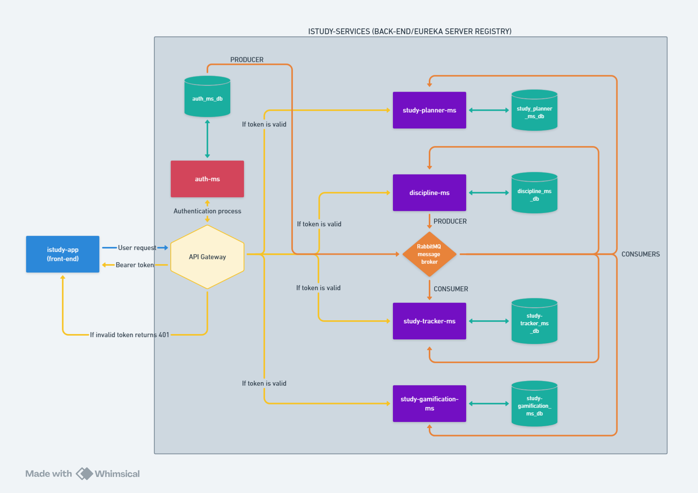
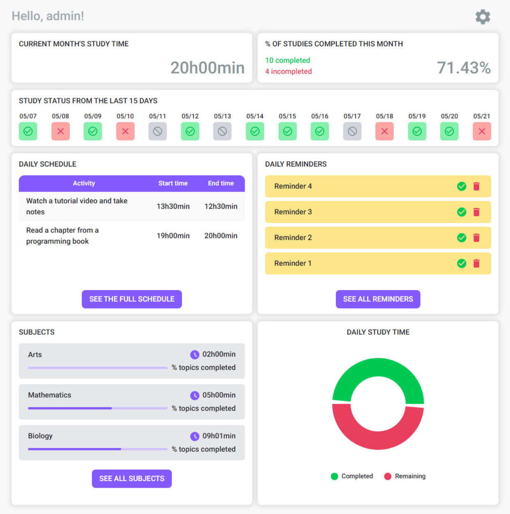
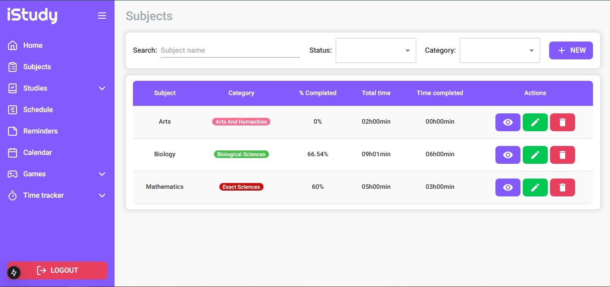
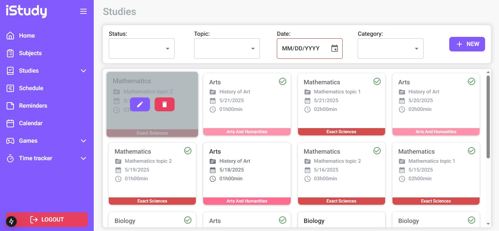
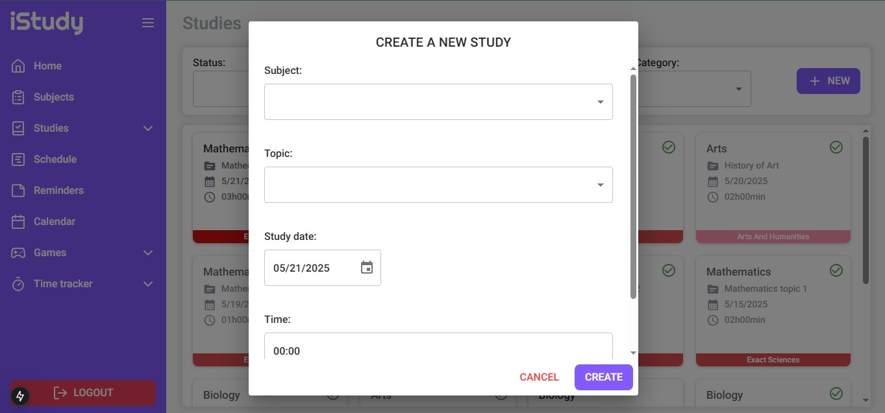
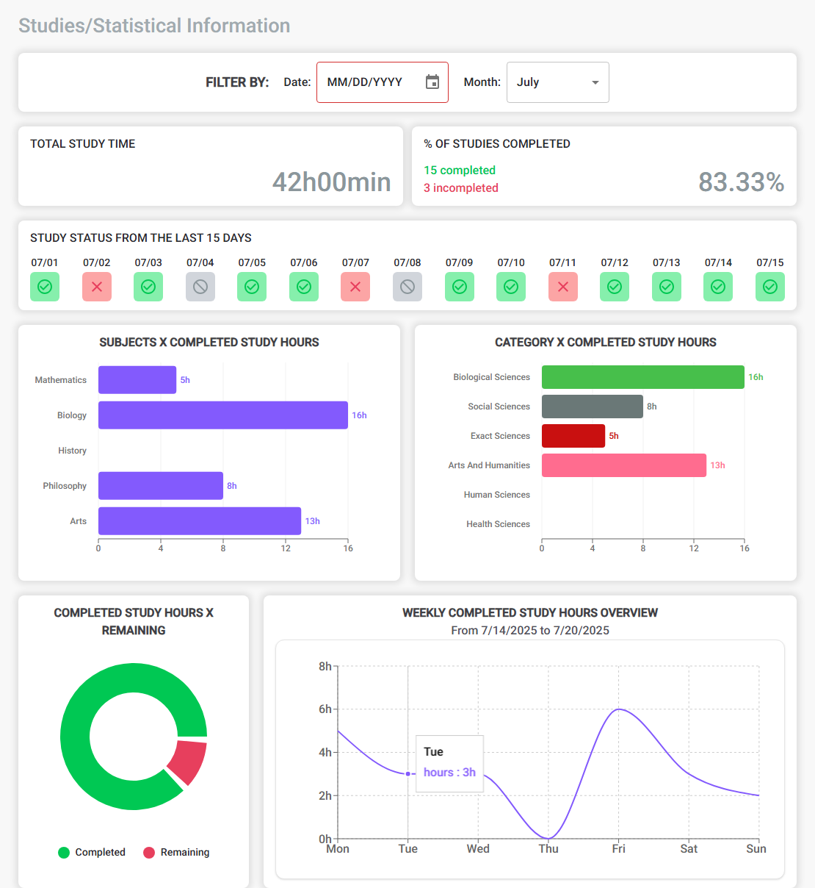

<p align="center">
  
  
  <a href="/README-pt-br.md">
    
  </a>
</p>


<p align="center">
  
  
  
  
  
  
  
  
  
  
</p>

</br>

# What is iStudy?
iStudy is a web platform designed to help students organize, manage, and track their studies and academic routine more efficiently. Among its various features are:

- User registration and login;
- Management of subjects and their topics;
- Management of study sessions based on the registered subjects and topics;
- Performance charts (daily, weekly, and monthly), allowing students to better visualize their study progress over time;
- Gamification, with flashcard and quiz games to reinforce learning;
- Time management tools (stopwatch and Pomodoro timer);
- Weekly schedule and reminder management;
- Calendar.

</br>

# Project Structure
- `istudy-app`: This folder contains the front-end code of the application, built with TypeScript, React.Js and NextJS.
- `istudy-services`: This directory contains the back-end of the system, built with Java and Spring Boot, following a microservices architecture. It leverages Spring Cloud API Gateway to handle and route incoming requests, uses Spring Cloud Netflix (Eureka) for service registration and discovery, and integrates RabbitMQ as a message broker for asynchronous communication between the microservices.

## System Architecture


## Database EER Diagram


</br>

# Technologies Used
## Back-End
* **Java**: A high-level, object-oriented programming language widely used for building server-side applications, web services, and Android applications.

* **Spring Boot**: A framework that simplifies the development of Java applications by providing built-in features for dependency injection, configuration, and microservices support.

* **Spring Security**: A powerful and customizable authentication and access control framework for Java applications.

* **JWT (JSON Web Token)**: Open standard that allows secure transmission of authentication information.

* **Spring Cloud API Gateway**: Serves as the central entry point, handling request routing, authentication, and traffic control between microservices.

* **Spring Cloud Netflix Eureka**: Enables automatic registration and discovery of microservices, facilitating dynamic scaling and seamless communication.

* **RabbitMQ**: An open-source software that acts as a message broker, or middleman, between producers and consumers of messages.

* **Jakarta Bean Validation**: A standard framework for declaring and validating constraints on Java objects using annotations, commonly used to enforce business rules and input validation in a clean and declarative way.

* **JPA**: The Java Persistence API, a specification that provides object-relational mapping (ORM) to manage relational data in Java applications.

* **MapStruct**: A Java mapping framework that simplifies object-to-object mapping, reducing boilerplate code and improving maintainability.

* **Flyway**: A database migration tool that ensures version control and consistency across database schema changes.

* **Lombok**: A Java library that reduces boilerplate code by generating common methods like getters, setters, constructors, and more through annotations.

* **Postman**: A tool used for API testing and development, enabling users to send HTTP requests, inspect responses, and automate API tests.

## Front-End
* **TypeScript**: A superset of JavaScript that adds static typing, making code easier to read, debug, and maintain.

* **React.js**: A JavaScript library for building user interfaces, focusing on creating reusable UI components and managing the view layer in web applications.

* **NextJS**: Next. js is a React framework that enables several extra features, including server-side rendering and static rendering.

* **TailwindCSS**: A utility-first CSS framework that allows rapid UI development using predefined classes.

* **Material UI (MUI)**: MUI is a massive library of UI components designers and developers can use to build React applications.

* **Tanstack/React Query**: A powerful data-fetching and state management library for React, ideal for managing server state with features like caching, background updates, and retries.

* **JWT Decode**: A small library that decodes JSON Web Tokens (JWT) without verifying their signature.

* **Lucide React**: A React library that provides access to Lucide’s beautiful and consistent set of SVG icons.

* **React Toastify**: A React library for showing toast notifications in a simple and customizable way.

* **Formik**: A form management library for React that simplifies form handling, validation, and submission.

* **Yup**:  A JavaScript schema builder for value parsing and validation, often used with Formik for form validation.

* **DayJs**: A lightweight JavaScript library for parsing, validating, manipulating, and formatting dates.

* **Swiper js**: A powerful, free, and open-source JavaScript library for creating modern, touch-friendly sliders and carousels.

* **Reactjs flip card**: A specific library or component that allows you to create a card that animates to reveal content on its back when clicked or interacted withxt.

* **React calendar**: A lightweight and easily configurable calendar component.

## Databases and other technologies
* **MySQL**: A relational database management system used for reliable data storage and management.

* **Docker**: A platform that allows developers to automate the deployment of applications inside lightweight containers, ensuring consistency across different environments and simplifying the setup process.

</br>

# Requirements
To run the project on your machine, the following tools must be installed and configured beforehand:

- Docker
- Git

Optional for local development or testing:

- Java Development Kit (JDK) 17
- Node.js
- Apache Maven
- MySQL 8.0.34
- MySQL Workbench
- Postman

</br>

# Installation guide
Follow the steps below to download, configure, and run the project in your environment:

1. **Clone the repository**
```bash
git clone https://github.com/ABeatrizSC/istudy.git
 ```

2. **Navigate to the project directory**

```bash
cd istudy
 ```

3. **Build and initialize the docker container**

 ```bash
docker-compose up --build
 ```

</br>

# iStudy-app - Front-End
## Pages preview
### Login page
 

### Register page
 

### Home page

#### Home page: User account settings modal


### Subject page

#### Subject page: Create/update subject modal
 
#### Subject page: Delete subject modal
 

### Subject Management page

#### Subject Management page: Create/Update topic modal
 
#### Subject Management page: Delete topic modal
 

### Studies page
 
#### Studies page: Create/update study modal
 
#### Studies page: Delete study modal
 

### Studies Statistical Information page
 

### Reminders page
 

### Schedules page
 
#### Schedules page: Create/update schedule item  modal
 
#### Schedules page: Delete schedule item modal
 

### Calendar page
 

### Games
#### Games: Flashcards page
 
#### Games: Create/update Flashcards modal
 
#### Games: Delete Flashcards modal
 
#### Games: Flashcard game page
 
#### Games: Flashcard result game page
 
#### Games: Quiz page
 
#### Games: Create/update Quiz modal
 
#### Games: Delete Quiz modal
 
#### Games: Quiz game page
 
#### Games: Quiz result page
 

### Time tracker
#### Time tracker: Timer page
 
#### Time tracker: Pomodoro page
 
##### Time tracker: Pomodoro settings modal
 

### Not found Page
 

</br>

# iStudy-services - Back-End
## 1. AUTH-MS
- Authentication and user management microservice.
### **POST** `/auth/register`
- Create a new user.

#### Request Body

```json
{
    "name": "New user",
    "email": "newuser@email.com",
    "password": "12345678"
}
```

#### Success Response Body

```json
{
    "message": "User created successfully!"
}
```
---

### **POST** `/auth/login`
- Authenticate a user.

#### Request Body

```json
{
    "email": "newuser@email.com",
    "password": "12345678"
}
```

#### Success Response Body

```json
{
    "token": "ey..."
}
```
---

### **PUT** `/users`
- Updates a user's account information.

#### Request Body
- `UpdateAccountDto`:

```json
{
  "name": "username updated",
  "email": "user@email.com",
  "currentPassword": "pass1234",
  "newPassword": "newPass" //Optional. Only fill in if you are going to update the password.
}
```

#### Success Response Body

```json
Account updated successfully!
```

---

### **DELETE** `/users`
- Deletes the user account and all information related to it.

#### Request Body
- `DeleteAccountDto`:

```json
{
  "password": "pass1234"
}
```

#### Success Response Body

```json
Account deleted successfully!
```

---

### **GET** `/users/details`
- Returns the authenticated user information.

#### Success Response Body
- `AccountDetailsDto`:

```json
{
  "name": "user",
  "email": "user@email.com"
}
```

---

### **GET** `/users/{id}`
- Returns the information of the user with the given ID, if it matches the authenticated user.

#### Success Response Body
- `User`:

```json
{
  "id": "c7019a95-90f1...",
  "name": "user",
  "email": "user@email.com"
}
```

---

</br>

## 2. DISCIPLINE-MS
- Microservice responsible for creating, updating, deleting, and generating information about disciplines and their topics.

### DISCIPLINE ENDPOINTS

### **POST** `/disciplines`
- Create a new subject.

#### Request Body
- `DisciplineRequestDto`:

```json
{
  "name": "Mathematics",
  "category": "EXACT_SCIENCES",
  "isCompleted": false
}
```

#### Success Response Body
- Status: `201 Created`.
- Returns `List<Discipline>`: 

```json
[
    {
        "id": "0ff67f43-11c2-458c-a88c-753f3c939a33",
        "createdBy": "6a93f671-9406-42ea-8b0c-5d7ef65ea9b5",
        "name": "Mathematics",
        "category": "EXACT_SCIENCES",
        "totalTime": "00:00:00",
        "timeCompleted": "00:00:00",
        "isCompleted": false,
        "topics": []
    }
]
```
---
### **PUT** `/disciplines/{id}`
- Update the subject with the given ID.

#### Request Body
- `DisciplineRequestDto`

#### Success Response Body
- `List<Discipline>` updated. 

---
### **DELETE** `/disciplines/{id}`
- Delete the subject with the given ID.

#### Success Response Body
- `List<Discipline>` updated. 

---

### **GET** `/disciplines/{id}`
- Returns the subject with the given ID.

#### Success Response Body
- `Discipline`. 

---

### **GET** `/disciplines?name={name}`
- Returns all of the user's subjects that contain the name provided in the query parameter.

#### Success Response Body
- `List<Discipline>` 

---

### **GET** `/disciplines/categories/{category}`
- Returns all of the user's subjects with the specified category.

#### Success Response Body
- `List<Discipline>` 

---

### **GET** `/disciplines/category`
- Returns a list of strings with all the categories available in the system.

#### Success Response Body
- `List<String>` 

```json
[
  "EXACT_SCIENCES",
  "HUMAN_SCIENCES",
  "BIOLOGICAL_SCIENCES",
  "SOCIAL_SCIENCES",
  "HEALTH_SCIENCES",
  "ARTS_AND_HUMANITIES"
]
```
---

### **GET** `/disciplines/completed`
- Returns all of the user's subjects with `isCompleted` attribute marked as True.

#### Success Response Body
- `List<Discipline>` 

</br>

### TOPIC ENDPOINTS
### **POST** `/disciplines/topics`
- Create a new topic.

#### Request Body
- `TopicRequestDto`:

```json
{
  "name": "New topic",
  "time": "03:00",
  "isCompleted": false,
  "disciplineId": "uuid"
}
```

#### Success Response Body
- `List<TopicResponseDto>` updated.

```json
[
  {
    "id": "uuid",
    "name": "Topic 1",
    "time": "01:30",
    "isCompleted": true,
    "disciplineId": "uuid"
  },
  {
    "id": "uuid",
    "name": "New topic",
    "time": "03:00",
    "isCompleted": false,
    "disciplineId": "uuid"
  }
  //...
]
```

---

### **PUT** `/disciplines/topics/{id}`
- Update the topic with the given ID.

### Request Body
- `TopicUpdateDto`:

```json
{
  "name": "New topic updated",
  "time": "03:00",
  "isCompleted": false,
}
```

#### Success Response Body
- `List<TopicResponseDto>` updated.

---

### **DELETE** `/disciplines/topics/{id}`
- Delete the topic with the given ID.

#### Success Response Body
- `List<TopicResponseDto>` updated.

---

### **GET** `/disciplines/topics/all`
- Returns all of the user's subjects

#### Success Response Body
- `List<TopicResponseDto>`

---

### **GET** `/disciplines/topics/{id}`
-  Returns the topic with the given ID.

- #### Success Response Body
- `TopicResponseDto`

</br>

## 3. STUDY-TRACKER-MS
- This microservice is responsible for managing study sessions. It allows users to create, update, retrieve, and delete study records.
- Additionally, it provides analytical insights into study habits based on different time periods.

### **POST** `/studies`
- Create a new study.

#### Request Body
- `StudyRequestDto`:

```json
{
  "disciplineName": "Mathematics",
  "topicName": "Linear Algebra",
  "time": "01:30:00",
  "date": "2025-05-21",
  "isCompleted": false
}
```

#### Success Response Body
- `List<Study>`

```json
[
  {
    "id": "abc123",
    "createdBy": "userId123",
    "disciplineName": "Mathematics",
    "topicName": "Linear Algebra",
    "disciplineCategory": "EXACT_SCIENCES",
    "time": "01:30:00",
    "date": "2025-05-21",
    "isCompleted": false
  }
]
```
---

### **PUT** `/studies/{id}`
- Update a study by ID.

#### Request Body
- `StudyRequestDto`

#### Success Response Body
- `List<Study>` updated

---

### **DELETE** `/studies/{id}`
- Delete a study by ID.

#### Success Response Body
- `List<Study>` updated
---

### **GET** `/studies/all`
- Returns all of the user's studies.

#### Success Response Body
- `List<Study>`.

---

### **GET** `/studies/{id}`
- Returns the user's study with the given ID.

#### Success Response body
- `Study`

---

### **GET** `/studies/completed`
- Returns all the user's studies with the `isCompleted` field set to true.

#### Success Response Body
- `List<Study>`

---

### Get Studies by Date, Week or Month 
- Returns all the user's studies on the specified date, week or month.

  1. **GET** `/studies/date?date=2025-05-21`

  2. **GET** `/studies/week?year=2025&week=21`

  3. **GET** `/studies/month?year=2025&month=5`

#### Success Response body
- `List<Study>`

---

### Get Study Info by Date, Week or Month
- Returns information about all the user's studies within the specified time:

  1. **GET** `/studies/date/info?date=2025-04-05`

  2. **GET** `/studies/week/info?year=2025&week=21`

  3. **GET** `/studies/month/info?year=2025&month=5`

#### Success Response body
- `StudyInfoDto`

```json
{
  "totalStudies": 6,
  "totalCompletedStudies": 4,
  "totalStudyTime": "10:00:00",
  "completedStudyTime": "06:00:00",
  "completedStudyTimeByDiscipline": [
    {
      "name": "Mathematics",
      "completedTime": "03:00:00"
    },
    {
      "name": "Biology",
      "completedTime": "00:00:00"
    },
    {
      "name": "Arts",
      "completedTime": "03:00:00"
    }
  ],
  "completedStudyTimeByDisciplineCategory": [
    {
      "name": "BIOLOGICAL_SCIENCES",
      "completedTime": "00:00:00"
    },
    {
      "name": "SOCIAL_SCIENCES",
      "completedTime": "00:00:00"
    },
    //...
  ]
}
```
---

### **GET** `/studies/subject-category?category=Humanities`
- Returns all the user's studies that have the specified category.

#### Success Response body
- `List<Study>`

---

### **GET** `/studies/status?startDate=2025-05-01&endDate=2025-05-21`
- Returns the studies status between two given dates.

#### Success Response Body
- `List<DailyStudyStatusDto>`

```json
[
  {
    "date": "2025-05-20",
    "metGoal": true,
    "dayStudied": true
  },
  {
    "date": "2025-05-21",
    "metGoal": false,
    "dayStudied": true
  }
]
```

## 4. STUDY-GAMIFICATION-MS
- Microservice that manages the creation of quizzes and flashcards to enhance user learning.

### QUIZ ENDPOINTS
### **POST** `/games/quizzes`
- Create a new quiz.

#### Request Body
- `QuizRequestDto`:

```json
{
  "title": "Java Quiz",
  "questions": [
    {
      "question": "What is Spring Boot?",
      "options": [
        { "option": "A programming language", "isCorrect": false },
        { "option": "A framework for Java applications", "isCorrect": true },
        { "option": "A database", "isCorrect": false }
      ]
    },
    {
      "question": "What is a DTO?",
      "answer": "Data Transfer Object",
      "options": [
        { "option": "Data Transfer Object", "isCorrect": true },
        { "option": "An entity class", "isCorrect": false }
      ]
    },
    // ...
  ]
}
```
#### Success Response Body
- `List<Quiz>` updated.

```json
[
  {
    "title": "Java Quiz",
    "questions": [
      {
        "question": "What is Spring Boot?",
        "options": [
          { "option": "A programming language", "isCorrect": false },
          { "option": "A framework for Java applications", "isCorrect": true },
          { "option": "A database", "isCorrect": false }
        ]
      },
      {
        "question": "What is a DTO?",
        "answer": "Data Transfer Object",
        "options": [
          { "option": "Data Transfer Object", "isCorrect": true },
          { "option": "An entity class", "isCorrect": false }
        ]
      },
      // ...
    ]
  },
  // ...
]
```

---

### **PUT** `/games/quizzes/{id}`
- Update the quiz with the given ID.

#### Request Body
- `QuizRequestDto`

#### Success Response Body
- `List<Quiz>` updated.

---

### **PUT** `/games/quizzes/answer/{id}`
- Answer the quiz with the given ID.

#### Request Body
- `QuizAnswerDto`

```json
{
  "title": "Java Quiz Up",
  "questions": [
    {
      "question": "What is Spring Boot?",
      "optionChosen": "A framework for Java applications",
      "options": [
        { "option": "A programming language", "isCorrect": false },
        { "option": "A framework for Java applications", "isCorrect": true },
        { "option": "A database", "isCorrect": false }
      ]
    },
    {
      "question": "What is a DTO?",
      "optionChosen": "An entity class",
      "answer": "Data Transfer Object",
      "options": [
        { "option": "Data Transfer Object", "isCorrect": true },
        { "option": "An entity class", "isCorrect": false }
      ]
    },
    // ...
  ]
}
```

#### Success Response Body
- Returns a `List<Question>` of all incorrect questions (`correctAnswer` attribute marked as false).

```json
[
  {
    "id": "uuid",
    "question": "What is Spring Boot?",
    "createdBy": "uuid",
    "optionChosen": "question_uuid",
    "correctAnswer": false,
    "options": [
      {
        "id": "uuid",
        "option": "A framework for Java applications",
        "createdBy": "uuid",
        "isCorrect": true
      },
      {
        "id": "uuid",
        "option": "A programming language",
        "createdBy": "uuid",
        "isCorrect": false
      },
      {
        "id": "uuid",
        "option": "A database",
        "createdBy": "uuid",
        "isCorrect": false
      }
    ]
  },
  // ...
]
```
---

### **DELETE** `/games/quizzes/{id}`
- Delete the quiz with the given ID.

#### Success Response Body
- `List<Quiz>` updated.

---
### **GET** `/games/quizzes/all`
- Returns all of the user's quizzes.

#### Success Response Body
- `List<Quiz>`

---

### **GET** `/games/quizzes/{id}`
- Returns the user's quiz with the given id.

#### Success Response Body
- `Quiz`

---

### **GET** `/games/quizzes/search?title={quizTitle}`
- Returns the user's quiz that contains the title provided in the query parameter.

#### Success Response Body
- `Optional<Quiz>`

</br>

### FLASHCARD ENDPOINTS
### **POST** `/games/flashcards`
- Create a new flashcard.

#### Request Body
- `FlashcardRequestDto`:

```json
{
  "title": "Programming Questions",
  "cards": [
    {
      "question": "What does 'HTML' stand for?",
      "answer": "HyperText Markup Language"
    },
    {
      "question": "What is the main purpose of CSS?",
      "answer": "To style and layout web pages"
    },
    {
      "question": "Which programming language is known as the backbone of Android app development?",
      "answer": "Java"
    },
    {
      "question": "What does 'API' stand for?",
      "answer": "Application Programming Interface"
    },
    {
      "question": "In JavaScript, which keyword declares a constant variable?",
      "answer": "const"
    }
  ]
}
```
#### Success Response Body
- `List<Flashcard>` updated.

```json
[
  {
    "id": "flashcard-uuid",
    "createdBy": "user-uuid",
    "title": "Programming Questions",
    "cards": [
      {
        "id": "q1-uuid-0001",
        "question": "What does 'HTML' stand for?",
        "answer": "HyperText Markup Language",
        "isHit": false
      },
      {
        "id": "q2-uuid-0002",
        "question": "What is the main purpose of CSS?",
        "answer": "To style and layout web pages",
        "isHit": false
      },
      {
        "id": "q3-uuid-0003",
        "question": "Which programming language is known as the backbone of Android app development?",
        "answer": "Java",
        "isHit": false
      },
      {
        "id": "q4-uuid-0004",
        "question": "What does 'API' stand for?",
        "answer": "Application Programming Interface",
        "isHit": false
      },
      {
        "id": "q5-uuid-0005",
        "question": "In JavaScript, which keyword declares a constant variable?",
        "answer": "const",
        "isHit": false
      },
      // ...
    ]
  },
  // ...
]
```

---

### **PUT** `/games/flashcards/{id}`
- Update the flashcard with the given ID.

#### Request Body
- `FlashcardRequestDto`

#### Success Response Body
- `List<Flashcard>` updated.

---

### **PUT** `/games/flashcards/answer/{id}`
- Answer the flashcard with the given ID.

#### Request Body
- `FlashcardAnswerDto`:

```json
{
  "cardsAnswer": [
     {
      "id": "q1-uuid-0001", //card uuid
      "isHit": false
    },
    {
      "id": "q2-uuid-0002",
      "isHit": false
    },
    {
      "id": "q3-uuid-0003",
      "isHit": true
    },
    {
      "id": "q4-uuid-0004",
      "isHit": true
    },
    {
      "id": "q5-uuid-0005",
      "isHit": false
    }
  ]
}
```

#### Success Response Body
- Returns a `List<Card>` of all incorrect questions (`isHit` attribute marked as false).

```json
[
  {
    "id": "q1-uuid-0001",
    "question": "What does 'HTML' stand for?",
    "answer": "HyperText Markup Language",
    "isHit": false
  },
  {
    "id": "q2-uuid-0002",
    "question": "What is the main purpose of CSS?",
    "answer": "To style and layout web pages",
    "isHit": false
  },
  {
    "id": "q5-uuid-0005",
    "question": "In JavaScript, which keyword declares a constant variable?",
    "answer": "const",
    "isHit": false
  },
  // ...
]
```

---

### **DELETE** `/games/flashcards/{id}`
- Delete the flashcard with the given ID.

#### Success Response Body
- `List<Flashcard>` updated.

---

### **GET** `/games/flashcards/all`
- Returns all of the user's flashcards.

#### Success Response Body
- `List<Flashcard>`

---

### **GET** `/games/flashcards/{id}`
- Returns the user's flashcard that contains the given id.

#### Success Response Body
- `Flashcard`

---

### **GET** `/games/flashcards/search?title={flashcardTitle}`
- Returns the user's flashcard that contains the title provided in the query parameter.

#### Success Response Body
- `Optional<Flashcard>`.

</br>

## 5. STUDY-PLANNER-MS
- Manages user reminders and schedules

### REMINDER ENDPOINTS

### **POST** `/planners/reminders`
- Create a new reminder.

#### Request Body
- `ReminderRequestDto`:

```json
{
  "task": "Study for the test",
  "date": "2025-05-23",
  "isCompleted": false
}
```

#### Success Response Body
- `List<Reminder>` updated.

```json
[
  {
    "id": "reminder-uuid-001",
    "createdBy": "user-uuid",
    "task": "Study for the test",
    "date": "2025-05-23",
    "isCompleted": false
  },
  // ...
]
```

---

### **PUT** `/planners/reminders/{id}`
- Update the user's reminder with the given ID.

#### Request Body
- `ReminderRequestDto`

#### Success Response Body
- `List<Reminder>` updated.

---

### **DELETE** `/planners/reminders/{id}`
- Delete the user's reminder with the given ID.

#### Success Response Body
- `List<Reminder>` updated.

---

### **GET** `/planners/reminders/all`
- Returns all reminders created by the user.

#### Success Response Body
- `List<Reminder>`

---

### **GET** `/planners/reminders/{id}`
- Returns the user's reminder with the given ID.

#### Success Response Body
- `Reminder`

---

### **GET** `/planners/reminders?date={date}`
- Returns all reminders of the user filtered by the given date (format: `yyyy-MM-dd`).

#### Success Response Body
- `List<Reminder>`

---

### **GET** `/planners/reminders/completed?isCompleted={true|false}`
- Returns all reminders of the user filtered by completion status.

#### Success Response Body
- `List<Reminder>`

</br>

### SCHEDULE ENDPOINTS

### **POST** `/planners/schedules`
- Create a new schedule item.

#### Request Body
- `ScheduleItemRequestDto`:

```json
{
  "title": "Math Class",
  "dayOfWeek": 1, // sunday: 0, monday: 1, tuesday: 2...
  "startTime": "08:00",
  "endTime": "09:30"
}
```

#### Success Response Body
- `List<ScheduleItem>` updated.

```json
[
  {
    "id": "schedule-uuid-001",
    "createdBy": "user-uuid",
    "title": "Math Class",
    "dayOfWeek": 1,
    "startTime": "08:00:00",
    "endTime": "09:30:00"
  },
  {
    "id": "schedule-uuid-002",
    "createdBy": "user-uuid",
    "title": "Physics Class",
    "dayOfWeek": 1,
    "startTime": "10:00:00",
    "endTime": "11:00:00"
  }
]
```

---

### **PUT** `/planners/schedules/{id}`
- Update the schedule item with the given ID.

#### Request Body
- `ScheduleItemRequestDto`

#### Success Response Body
- `List<ScheduleItem>` updated.

---

### **DELETE** `/planners/schedules/{id}`
- Delete the schedule item with the given ID.

#### Success Response Body
- `List<ScheduleItem>` updated.

---

### **GET** `/planners/schedules/all`
- Returns all schedule items created by the user.

#### Success Response Body
- `List<ScheduleItem>`

---

### **GET** `/planners/schedules/{id}`
- Returns the user's schedule item with the given ID.

#### Success Response Body
- `ScheduleItem`

---

### **GET** `/planners/schedules?dayOfWeek={number}`
- Returns all schedule items created by the user filtered by day of the week.
- Sunday = 0; Monday = 1; Tuesday = 3...

#### Success Response Body
- `List<ScheduleItem>` for the specified day.

</br>

## Error Messages

All error responses follow the format below:

```json
{
  "status": 400,
  "error": "BAD_REQUEST",
  "message": "Message explaining the error that occurred."
}
```

| Field     | Type     | Description                                                              |
|-----------|----------|--------------------------------------------------------------------------|
| `status`  | Integer  | HTTP status code of the error.                                           |
| `error`   | String   | Corresponding `HttpStatus` constant name.                                |
| `message` | String   | Descriptive error message, possibly coming from a custom exception.      |

---

### Errors Handled by the Services

#### Field validation error (`MethodArgumentNotValidException`)

```json
{
  "status": 400,
  "error": "BAD_REQUEST",
  "message": "The field 'email' must not be blank."
}
```

---

#### Invalid password (`InvalidPasswordException`)

```json
{
  "status": 400,
  "error": "BAD_REQUEST",
  "message": "Invalid password."
}
```
---

#### Access denied (`SecurityException`)

```json
{
  "status": 401,
  "error": "UNAUTHORIZED",
  "message": "You don't have permission to access this resource."
}
```

---

#### Invalid, expired, or missing token (`InvalidTokenException`)

```json
{
  "status": 401,
  "error": "UNAUTHORIZED",
  "message": "Invalid or expired token."
}
```

```json
{
  "status": 401,
  "error": "UNAUTHORIZED",
  "message": "Token null."
}
```

---

#### Resource not found (`NotFoundException`)

```json
{
  "status": 404,
  "error": "NOT_FOUND",
  "message": "Study not found."
}
```

---

#### User not found (`UserNotFoundException`)

```json
{
  "status": 404,
  "error": "NOT_FOUND",
  "message": "User not found."
}
```

---

#### Data conflict (`ConflictException`)

```json
{
  "status": 409,
  "error": "CONFLICT",
  "message": "This user already exists."
}
```

---

#### Email already in use (`EmailAlreadyInUseException`)

```json
{
  "status": 409,
  "error": "CONFLICT",
  "message": "Email already in use."
}
```

---

#### Missing or unavailable user ID (`UserIdUnavailableException`)

```json
{
  "status": 500,
  "error": "INTERNAL_SERVER_ERROR",
  "message": "User ID is missing from header request."
}
```

---

#### Error generating Bearer Token (`JWTCreationException`)

```json
{
  "status": 500,
  "error": "INTERNAL_SERVER_ERROR",
  "message": "An error occurred while creating the token."
}
```

---

#### Error communicating with external service (`FeignConnectionException`)
- Occurs when a REST call using OpenFeign between the `study-tracker-ms` and `discipline-ms` microservices fails.

```json
{
  "status": 500,
  "error": "INTERNAL_SERVER_ERROR",
  "message": "Failed to connect to the external microservice."
}
```

</br>

# Contact
* GitHub: [ABeatrizSC](https://github.com/ABeatrizSC)
* Linkedin: [Ana Beatriz Santucci Carmoni](www.linkedin.com/in/ana-carmoni)
* Email: [anabeatrizscarmoni@gmail.com](mailto:anabeatrizscarmoni@gmail.com)
