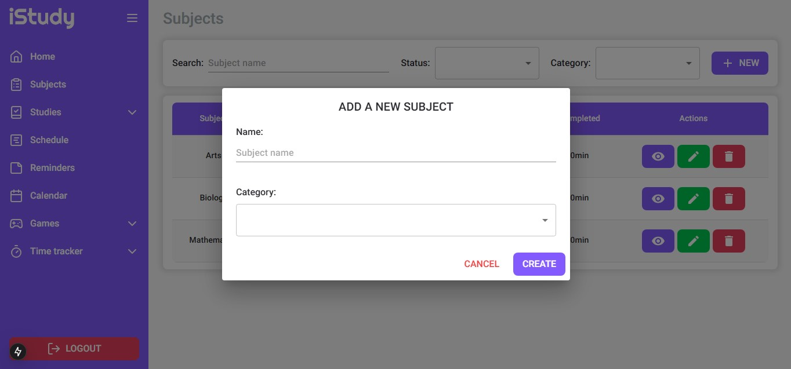

<p align="center">
  
  
</p>

<p align="center">
  
  
  
  
  
  
  
  
  
  
</p>

</br>

# What is iStudy?
iStudy is a web platform designed to help students efficiently organize, manage, and track their study habits. Among its many features are:

- User registration and login;
- Management of subjects and their topics;
- Study tracking, based on registered subjects and topics;
- Study games, such as flashcards and quizzes to reinforce learning;
- Time management tools (Stopwatch and Pomodoro timer);
- Schedule and reminder management;
- Dashboards with metrics of study hours per subject, topic, and category (daily, weekly, and monthly).

</br>

# Project Structure
- `istudy-app`: This folder contains the front-end code of the application, built with TypeScript, React.Js and NextJS.
- `istudy-services`: This folder contains the system's back-end (Java/Spring Boot), which follows a microservices architecture using Spring Cloud API Gateway as a request interceptor and Spring Cloud Netflix (Eureka) for service registration and discovery.


(Preliminary draft of the system architecture. Some inaccuracies may be present as I am still in the learning and understanding phase.)

</br>

# Technologies Used

At the moment, these are the technologies used:

## Back-End
* **Java**: A high-level, object-oriented programming language widely used for building server-side applications, web services, and Android applications.

* **Spring Boot**: A framework that simplifies the development of Java applications by providing built-in features for dependency injection, configuration, and microservices support.

* **Spring Security**: A powerful and customizable authentication and access control framework for Java applications.

* **JWT (JSON Web Token)**: Open standard that allows secure transmission of authentication information.

* **Spring Cloud API Gateway**: Serves as the central entry point, handling request routing, authentication, and traffic control between microservices.

* **Spring Cloud Netflix Eureka**: Enables automatic registration and discovery of microservices, facilitating dynamic scaling and seamless communication.

* **RabbitMQ**: An open-source software that acts as a message broker, or middleman, between producers and consumers of messages.

* **JPA**: The Java Persistence API, a specification that provides object-relational mapping (ORM) to manage relational data in Java applications.

* **MapStruct**: A Java mapping framework that simplifies object-to-object mapping, reducing boilerplate code and improving maintainability.

* **Flyway**: A database migration tool that ensures version control and consistency across database schema changes.

* **Lombok**: A Java library that reduces boilerplate code by generating common methods like getters, setters, constructors, and more through annotations.

* **Postman**: A tool used for API testing and development, enabling users to send HTTP requests, inspect responses, and automate API tests.

## Front-End
* **TypeScript**: A superset of JavaScript that adds static typing, making code easier to read, debug, and maintain.

* **React.js**: A JavaScript library for building user interfaces, focusing on creating reusable UI components and managing the view layer in web applications.

* **NextJS**: Next. js is a React framework that enables several extra features, including server-side rendering and static rendering.

* **TailwindCSS**: A utility-first CSS framework that allows rapid UI development using predefined classes.

* **Material UI (MUI)**: MUI is a massive library of UI components designers and developers can use to build React applications.

* **Tanstack/React Query**: A powerful data-fetching and state management library for React, ideal for managing server state with features like caching, background updates, and retries.

* **JWT Decode**: A small library that decodes JSON Web Tokens (JWT) without verifying their signature.

* **Lucide React**: A React library that provides access to Lucide’s beautiful and consistent set of SVG icons.

* **React Toastify**: A React library for showing toast notifications in a simple and customizable way.

* **Formik**: A form management library for React that simplifies form handling, validation, and submission.

* **Yup**:  A JavaScript schema builder for value parsing and validation, often used with Formik for form validation.

* **DayJs**: A lightweight JavaScript library for parsing, validating, manipulating, and formatting dates.

* **Swiper js**: A powerful, free, and open-source JavaScript library for creating modern, touch-friendly sliders and carousels.

* **React card flip**: A specific library or component that allows you to create a card that animates to reveal content on its back when clicked or interacted withxt.

* **React calendar**: A lightweight and easily configurable calendar component.

## Databases and other technologies
* **Docker**: A platform that allows developers to automate the deployment of applications inside lightweight containers, ensuring consistency across different environments and simplifying the setup process.

* **MySQL**: A relational database management system used for reliable data storage and management.

</br>

# Requirements
To run the project on your machine, the following tools must be installed and configured beforehand:

- Docker
- Git

Optional for local development or testing:

- Java Development Kit (JDK) 17
- Node.js
- Apache Maven
- MySQL 8.0.34
- MySQL Workbench
- Postman

</br>

# Installation guide
Follow the steps below to download, configure, and run the project in your environment:

1. **Clone the repository**
```bash
git clone https://github.com/ABeatrizSC/istudy.git
 ```

2. **Navigate to the project directory**

```bash
cd istudy
 ```

3. **Build and initialize the docker container**

 ```bash
docker-compose up --build
 ```

</br>

# iStudy-services - Back-End
## Summary endpoints
As the project is still in progress and subject to changes, this is a brief summary of all the available endpoints in each microservice and their functionality:

### 1. AUTH-MS
- Authentication and user management microservice.

| Method  | Endpoint                  | Description                         | Request Body                   | Response Body                           |
|---------|---------------------------|------------------------------------------|--------------------------------|-----------------------------------------|
| **POST**  | /auth/login              | Authenticates a user and returns a JWT token | `LoginRequestDto` (email, password) | LoginResponseDto (JWT token)           |
| **POST**  | /auth/register           | Registers a new user                     | `RegisterRequestDto` (name, email, password) | RegisterResponseDto |
| **GET**   | /auth/authenticated-user  | Retrieves the authenticated user from the token | - | String (user ID) |
| **GET**   | /users/{id}              | Fetches a user by ID if authorized      | - | `User` |

### 2. DISCIPLINE-MS
- Microservice responsible for creating, updating, deleting, and generating information about disciplines and their topics.

#### Discipline endpoints

| Method  | Endpoint                      | Description                                              | Request Body                   | Response Body                          |
|---------|--------------------------------|----------------------------------------------------------|--------------------------------|----------------------------------------|
| **POST**   | /disciplines                 | Creates a new discipline                                 | DisciplineRequestDto           | `List<Discipline>`     |
| **PUT**    | /disciplines/{id}            | Updates an existing discipline by ID                     | DisciplineRequestDto           | `List<Discipline>`                      |
| **DELETE** | /disciplines/{id}            | Deletes a discipline by ID                               | -                            | `List<Discipline>`                      |
| **GET**    | /disciplines                 | Retrieves a discipline by name                           | - (Query Param: name)        | `Discipline`                            |
| **GET**    | /disciplines/all             | Retrieves all disciplines                                | -                            | `List<Discipline>`                      |
| **GET**    | /disciplines/{id}            | Retrieves a discipline by ID                             | -                            | `Discipline`                            |
| **GET**    | /disciplines/categories/{category} | Retrieves all disciplines by category                    | -                            | `List<Discipline>`                      |
| **GET**    | /disciplines/categories | Retrieves all disciplines category                    | -                            | `String[]`                      |
| **GET**    | /disciplines/search          | Returns all disciplines that have the searched character | - (Query Param: name)        | `List<Discipline>`                      |
| **GET**    | /disciplines/completed       | Retrieves all completed disciplines                      | -                            | `List<Discipline>`                      |

#### Topic endpoints

| Method  | Endpoint                      | Description                                | Request Body                   | Response Body                          |
|---------|--------------------------------|-------------------------------------------------|--------------------------------|----------------------------------------|
| **POST**   | /disciplines/topics          | Creates a new topic                             | `TopicRequestDto`                | `List<TopicResponseDto>`               |
| **PUT**    | /disciplines/topics/{id}     | Updates an existing topic by ID                 | `TopicUpdateDto`                 | `List<TopicResponseDto>`               |
| **DELETE** | /disciplines/topics/{id}     | Deletes a topic by ID                           | -                            | `List<TopicResponseDto>`               |
| **GET**    | /disciplines/topics          | Retrieves a topic by name                       | Query Param: `name`        | `TopicResponseDto`                       |
| **GET**    | /disciplines/topics/all      | Retrieves all topics                            | -                            | `List<TopicResponseDto>`               |
| **GET**    | /disciplines/topics/{id}     | Retrieves a topic by ID                         | -                            | `TopicResponseDto`                       |

### 3. STUDY-TRACKER-MS
- This microservice is responsible for managing study sessions. It allows users to create, update, retrieve, and delete study records.
- Additionally, it provides analytical insights into study habits based on different time periods.

| **Method** | **Endpoint**                 | **Description**                                | **Request Body**                                | **Example**                                      |
|-----------|------------------------------|------------------------------------------------|-------------------------------------------------|--------------------------------------------------|
| **POST**  | `/studies`                    | Creates a new study record.                   | `StudyRequestDto`                               | -                                                |
| **PUT**   | `/studies/{id}`               | Updates a study record by ID.                 | Path variable: `{id} (String)`, `StudyRequestDto` | -                                                |
| **DELETE** | `/studies/{id}`              | Deletes a study record by ID.                 | Path variable: `{id} (String)`                  | -                                                |
| **GET**   | `/studies/all`                | Retrieves all study records.                  | -                                            | -                                                |
| **GET**   | `/studies/{id}`               | Retrieves a study by ID.                      | Path variable: `{id} (String)`                  | -                                                |
| **GET**   | `/studies/completed`          | Retrieves completed study sessions.           | -                                            | -                                                |
| **GET**   | `/studies/date`               | Retrieves studies by a specific date.         | Query param: `date (String, YYYY-MM-DD)`        | `GET /studies/date?date=2024-03-01`              |
| **GET**   | `/studies/month`              | Retrieves studies for a specific month.       | Query param: `year (Integer), month (Integer)`  | `GET /studies/month?year=2024&month=3`           |
| **GET**   | `/studies/month/info`         | Retrieves study statistics for a month.       | Query param: `year (Integer), month (Integer)`  | `GET /studies/month/info?year=2024&month=3`      |
| **GET**   | `/studies/week`               | Retrieves studies for a specific week.        | Query param: `year (Integer), week (Integer)`   | `GET /studies/week?year=2024&week=10`            |
| **GET**   | `/studies/week/info`          | Retrieves study statistics for a week.        | Query param: `year (Integer), week (Integer)`   | `GET /studies/week/info?year=2024&week=10`       |
| **GET**   | `/studies/subject-category`   | Retrieves studies by subject category.        | Query param: `category (String)`               | `GET /studies/subject-category?category=HUMAN_SCIENCES`    |

### 4. STUDY-GAMIFICATION-MS
- Microservice that manages the creation of quizzes and flashcards to enhance user learning.

#### Quiz Endpoints

| Method   | Endpoint                      | Description                                       | Request Body     | Response Body     |
|----------|--------------------------------|---------------------------------------------------|------------------|-------------------|
| **POST**  | `/games/quizzes`              | Creates a new quiz                                | `QuizRequestDto` | `List<Quiz>`      |
| **PUT**   | `/games/quizzes/{id}`         | Updates a quiz by ID                              | `QuizRequestDto` | `List<Quiz>`      |
| **PUT**   | `/games/quizzes/answer/{id}`  | Answers a quiz by ID and returns wrong answers | `QuizAnswerDto`  | `List<Question>`  |
| **DELETE** | `/games/quizzes/{id}`        | Deletes a quiz by ID                              | -                | `List<Quiz>`      |
| **GET**   | `/games/quizzes/all`          | Retrieves all quizzes                             | -                | `List<Quiz>`      |
| **GET**   | `/games/quizzes/{id}`         | Retrieves a quiz by ID                            | -                | `Quiz`            |
| **GET**   | `/games/quizzes/search?title={title}` | Retrieves a quiz by title                         | -                | `Optional<Quiz>`  |

#### Flashcard Endpoints

| Method   | Endpoint                          | Description                    | Request Body          | Response Body      |
|----------|----------------------------------|--------------------------------|-----------------------|--------------------|
| **POST**  | `/games/flashcards`              | Creates a new flashcard        | `FlashcardRequestDto` | `List<Flashcard>` |
| **PUT**   | `/games/flashcards/{id}`         | Updates a flashcard by ID      | `FlashcardRequestDto` | `List<Flashcard>` |
| **PUT**   | `/games/flashcards/answer/{id}`  | Answers a flashcard by ID and return cards marked as wrong     | `FlashcardAnswerDto`  | `List<Card>`      |
| **DELETE** | `/games/flashcards/{id}`        | Deletes a flashcard by ID      | -                     | `List<Flashcard>` |
| **GET**   | `/games/flashcards/all`         | Retrieves all flashcards       | -                     | `List<Flashcard>` |
| **GET**   | `/games/flashcards/{id}`        | Retrieves a flashcard by ID    | -                     | `Flashcard`       |
| **GET**   | `/games/flashcards/search?title={title}` | Retrieves a flashcard by title | -                     | `Optional<Flashcard>` |

### 5. STUDY-PLANNER-MS
- Manages user reminders and schedules

#### Reminder endpoints
| Method | Endpoint                                              | Description                                                         | Request Body             | Response Body                 |
|--------|-------------------------------------------------------|---------------------------------------------------------------------|--------------------------|-------------------------------|
| GET    | `/planners/reminders?date=yyyy-MM-dd`                | Retrieves reminders for a specific date (e.g., 2025-05-02)          | -                        | `List<ReminderResponseDto>`   |
| GET    | `/planners/reminders/all`                            | Retrieves all reminders                                             | -                        | `List<ReminderResponseDto>`   |
| GET    | `/planners/reminders/{id}`                           | Retrieves a reminder by its ID                                      | -                        | `ReminderResponseDto`         |
| GET    | `/planners/reminders/completed?isCompleted=true`     | Retrieves reminders by completion status (`true` or `false`)        | -                        | `List<ReminderResponseDto>`   |
| POST   | `/planners/reminders`                                | Creates one or more reminders                                       | `ReminderRequestDto`     | `List<ReminderResponseDto>`   |
| PUT    | `/planners/reminders/{id}`                           | Updates a reminder by its ID                                        | `ReminderRequestDto`     | `List<ReminderResponseDto>`   |
| DELETE | `/planners/reminders/{id}`                           | Deletes a reminder by its ID                                        | -                        | `List<ReminderResponseDto>`   |

#### Schedule endpoints
| Method | Endpoint                                               | Description                                                              | Request Body               | Response Body                    |
|--------|--------------------------------------------------------|--------------------------------------------------------------------------|----------------------------|----------------------------------|
| GET    | `/planners/schedules?dayOfWeek=1`                      | Retrieves schedule items for a given day of the week (`1 = Monday`, etc) | -                          | `List<ScheduleItemResponseDto>` |
| GET    | `/planners/schedules/all`                              | Retrieves all schedule items                                             | -                          | `List<ScheduleItemResponseDto>` |
| GET    | `/planners/schedules/{id}`                             | Retrieves a schedule item by its ID                                      | -                          | `ScheduleItemResponseDto`       |
| POST   | `/planners/schedules`                                  | Creates one or more schedule items                                       | `ScheduleItemRequestDto`   | `List<ScheduleItemResponseDto>` |
| PUT    | `/planners/schedules/{id}`                             | Updates a schedule item by its ID                                        | `ScheduleItemRequestDto`   | `List<ScheduleItemResponseDto>` |
| DELETE | `/planners/schedules/{id}`                             | Deletes a schedule item by its ID                                        | -                          | `List<ScheduleItemResponseDto>` |     |

### STATUS CODE MEANINGS
- **`200 OK`** → Request was successful.
- **`201 Created`** → A new resource was successfully created.
- **`400 Bad Request`** → Invalid input parameters or a duplicate name exists.
- **`401 Unauthorized`** → User must be authenticated to perform this action.
- **`404 Not Found`** → The requested resource does not exist.

</br>

# iStudy-app - Front-End
## Pages preview
- Since it's still under development, I'm sharing just a few previews of the screens/pages that are already finished:

### Login page
 

### Register page
 

### Subject page

#### Subject page: Create subject modal
 

### Subject Management page


#### Subject Management page: Create topic modal
 

#### Subject Management page: Delete topic modal
 

### Studies page
 

#### Studies page: Create study modal
 

### Reminders page
 

### Schedules page
 
#### Schedules page: Create schedule modal
 

### Calendar page
 

### Games
#### Games: Flashcards page
 
#### Games: Flashcards create modal
 
#### Games: Flashcard game page
 
#### Games: Flashcard result game page
 

### Time tracker
#### Time tracker: Timer page
 
#### Time tracker: Pomodoro page
 
#### Time tracker: Pomodoro settings modal
 

# Contact
* GitHub: [ABeatrizSC](https://github.com/ABeatrizSC)
* Linkedin: [Ana Beatriz Santucci Carmoni](www.linkedin.com/in/ana-carmoni)
* Email: [anabeatrizscarmoni@gmail.com](mailto:anabeatrizscarmoni@gmail.com)
